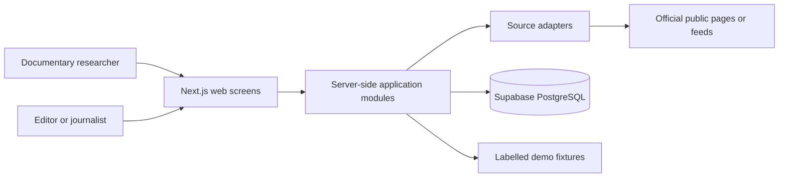
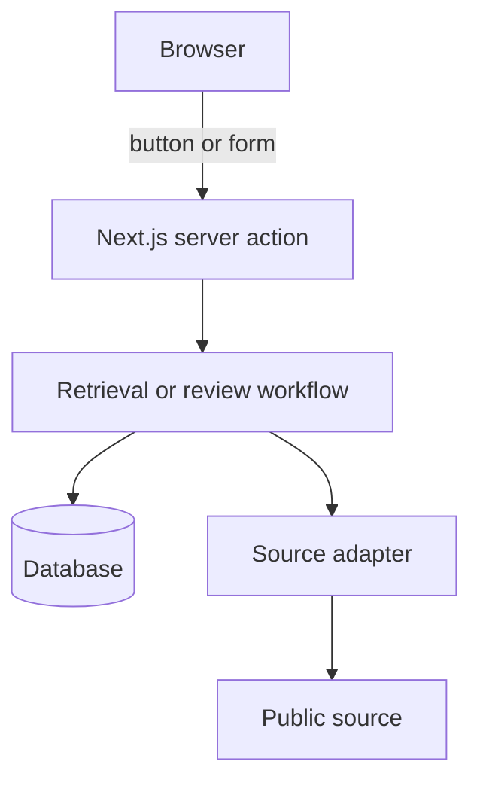
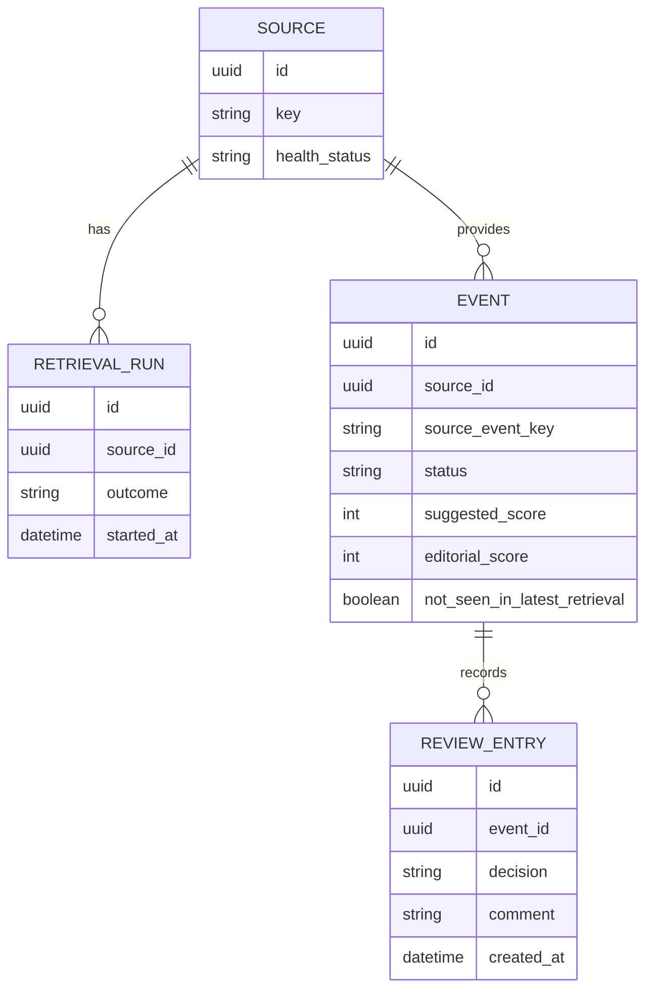

# Architecture Spine — Public Agenda Monitor MVP

## Plain-language orientation

This is one small web application, not several systems. It has three clear jobs:

1. Fetch events from an official public source when a researcher presses **Retrieve events**.
2. Give researchers a private working queue to review, score, comment on, and decide events.
3. Show only approved events in the editor agenda.

The application keeps the event data, review history, and source-health messages in one database. A source problem never erases earlier results.

## Design Paradigm

**Modular monolith with ports-and-adapters.** One Next.js application contains the screens, server-side workflows, and source adapters. There is no separate backend or API service. A source adapter is a small replaceable connector for one public site; the rest of the application only works with the shared normalized event format.



## Invariants & Rules

### AD-1 — One simple application boundary

- **Binds:** all MVP capabilities
- **Prevents:** separate frontend, backend, and one-off source tools that disagree about event data
- **Rule:** Build one Next.js application. Organize it into `app` (screens/routes), `modules` (workflows), `adapters` (one source connector each), and `lib` (shared types and database access). No separate API service, queue, or crawler is part of the MVP.

### AD-2 — A source adapter is replaceable

- **Binds:** Federal Administrative Court, Federal President, UN Women, and Federal Constitutional Court retrieval
- **Prevents:** source-specific fields leaking into the agenda or four incompatible implementations
- **Rule:** Every adapter accepts a retrieval request and returns either normalized events or one structured source-health result. It must not write directly to the database. Add adapters through the same interface in this order: Federal Administrative Court, Federal President, UN Women, then Federal Constitutional Court. The Federal Administrative Court adapter retrieves `https://www.bverwg.de/rss/termine.rss` for hearing and judgment dates. The Federal President adapter first reads the supplied Terminkalender page; if automated retrieval is blocked or cannot be reliably parsed, it uses `https://www.bundespraesident.de/SiteGlobals/Functions/RSSFeed/DE/RSSNewsfeed/Termine/RSSNewsfeed.xml?nn=127360` as its official appointments RSS fallback. The UN Women adapter first reads the official News and Publications pages, then falls back to `https://www.unwomen.org/en/feeds/news` for News or `https://www.unwomen.org/en/feeds/publications` for Publications when its respective page cannot be retrieved or reliably parsed. The `/rss-feeds/...` URLs are information pages, not direct feeds. These three fallback endpoints were officially listed and checked on 2026-09-13. The Federal Constitutional Court adapter uses `https://www.bundesverfassungsgericht.de/DE/Aktuelles/TermineWochenausblick/termine-Wochenausblick_node.html` as its official website/weekly outlook and a separate newsletter, with no RSS.

### AD-3 — One mutation path

- **Binds:** retrieval, review, ranking, approval, rejection, and source health
- **Prevents:** the browser changing database records directly or different screens applying different business rules
- **Rule:** Only server-side application actions may change data. A button or form in the browser calls a server action inside the same Next.js app; it is not a separate API to build. Browser code never receives a privileged database key or writes tables directly. Store secrets only in server/deployment environment variables.



### AD-4 — Stable event identity and safe retrieval

- **Binds:** duplicate prevention, repeat retrievals, candidate and agenda views
- **Prevents:** one appointment appearing as multiple rows or a source refresh losing editorial work
- **Rule:** An event is identified by `source_id + source_event_key`. Derive `source_event_key` from the source's canonical detail URL or RSS GUID; only when neither exists, use the Source, normalised title, and source date. Retrieval upserts the current normalized source facts for that key; it does not create a new event. A retrieval may never overwrite the editorial decision, manual score, rank, or comment.

### AD-5 — Editorial review is the gate

- **Binds:** candidate queue, scoring, learning feedback, and editor agenda
- **Prevents:** automatic publication or a scoring rule silently excluding an event
- **Rule:** Every retrieved event starts as `candidate`. Only an explicit researcher decision can make it `approved` or `rejected`; only `approved` events whose start date is today through the following 13 calendar days appear in the editor agenda. Record each decision, score change, and comment as an append-only review entry. Suggestions may order candidates but never decide them.

### AD-6 — Source failure remains visible and non-destructive

- **Binds:** source health, fallback fixtures, and existing events
- **Prevents:** a parsing change silently deleting the agenda or hiding a failed source
- **Rule:** Each retrieval creates a retrieval-run record. If a source page changes or parsing fails, mark that run and source as unhealthy, keep prior events intact, and display the error in the researcher view. A fixture may be used only when visibly labelled as demo data.

### AD-7 — MVP access boundary

- **Binds:** deployment and all data access
- **Prevents:** treating the hackathon demo as a public editorial system
- **Rule:** The MVP has no user accounts, as specified. Share the deployed URL only with the hackathon team. The database denies anonymous browser access; only the server-side application uses its protected database credential. Before broader access, add authentication and explicit access policies; this is a release blocker, not an optional enhancement.

### AD-8 — The normalized event contract is complete

- **Binds:** every source adapter, candidate list, event detail, and editor agenda
- **Prevents:** an adapter providing too little information for another screen or inventing incompatible field names
- **Rule:** Every normalized event supplies: internal ID; source ID and source-event key; title; topic (optional); event type; start date; start time and timezone when known; protagonists or organizer (optional); location (optional); direct source URL; original source text needed for verification; first-seen and last-seen timestamps; and fixture flag. A missing optional source fact stays empty; it is never guessed.

### AD-9 — One authoritative editorial view

- **Binds:** new-event highlighting, candidate filtering/sorting, ranking, and the editor agenda
- **Prevents:** each screen calculating “new”, current decision, or ranking differently from the same review history
- **Rule:** The server builds one current editorial view per event from the event record plus its review entries. `new_since_last_review` means `first_seen_at` is later than the researcher’s latest completed queue review; it is cleared only when that event receives a review action. The candidate queue uses this view; the agenda selects `approved` from this same view.

### AD-10 — A deliberately small learning loop

- **Binds:** suggested score and priority ordering
- **Prevents:** a hidden or premature AI model deciding relevance differently from the documented editorial lens
- **Rule:** Start with transparent, editable source/event-type scoring rules. On retrieval, calculate and store the suggested score and its rule explanation. On review, store approval/rejection, editorial score, and comment. Once at least three reviewed events exist for the same source and event type, adjust the next suggested score by the rounded difference between prior editorial scores and their prior suggested scores, capped at 1–5; show that adjustment and the group's approval rate. Never auto-decide.

### AD-11 — Source changes do not erase an event

- **Binds:** repeated retrieval and the lifecycle of withdrawn or no-longer-listed appointments
- **Prevents:** a source removing an appointment silently deleting the team’s prior research or an obsolete event remaining indistinguishable
- **Rule:** If an event is absent from a successful retrieval, mark it `not_seen_in_latest_retrieval`; do not delete it or change its editorial status. A researcher decides whether it is withdrawn, still valid, or needs verification. The agenda visibly marks an approved event requiring verification rather than silently hiding it.

### AD-12 — One reproducible MVP environment

- **Binds:** database changes, deployment, and recovery from a bad release
- **Prevents:** manual dashboard changes, local/demo schema drift, or an unrecoverable deployment
- **Rule:** The repository contains all database changes as ordered Supabase migrations. Vercel has preview deployments for proposed changes and one production environment for the demo. Configure the same named environment variables in each environment; never commit their values. Restore only through the managed database’s backup/recovery tooling, and test migrations against fixture data before production deployment.

## Consistency Conventions

| Concern | Convention |
| --- | --- |
| Event identity | `source_id + source_event_key` is unique; use an opaque UUID as the internal event ID. |
| Dates and times | Store timestamps in UTC; preserve the original displayed date/time and timezone when supplied by the source. |
| Event status | `candidate`, `approved`, or `rejected`. Only a researcher decision changes status. |
| Normalized event | Use the complete AD-8 contract; source-specific raw fields stay inside that source adapter. |
| Scores | Suggested and editorial scores are integers from 1 to 5. The editorial score is optional until reviewed. |
| Review history | Append a review entry; never replace an old decision, score, or comment. |
| Current editorial view | Derive one server-side current view from the event and review history; all screens use it. |
| Source disappearance | Mark `not_seen_in_latest_retrieval`; retain the event and ask for verification. |
| Failures | Use a structured result with source, retrieval run, status, message, and timestamp; never delete data following a failure. |
| Fixtures | Fixture records must carry `is_fixture: true` and show a visible “Demo data” label. |

## Stack

| Name | Version |
| --- | --- |
| Next.js | 16.3.3 (Active LTS at architecture time) |
| TypeScript | Version pinned by the official starter lockfile |
| Supabase PostgreSQL | Managed current service; schema migrations live in the repository; anonymous browser access is denied |
| Supabase JavaScript client | Version pinned by the official Next.js starter lockfile |
| Vercel | Managed deployment for Next.js |

Use the official Supabase Next.js starter as the starting point. It provides the current, compatible project shape; the generated lockfile becomes the source of truth for exact package versions.

## Structural Seed

```text
public-agenda-monitor/
  app/                       # researcher and editor pages; server actions
  modules/
    retrieval/               # retrieve, normalize, upsert, source health
    review/                  # candidate decision, score, comment, ranking
    agenda/                  # approved-events read model
  adapters/
    federal-administrative-court/ # first end-to-end official RSS adapter
    federal-president/       # add after the first slice works
    un-women/                # news and publications; add after Federal President
    federal-constitutional-court/ # website/weekly outlook and newsletter; add last, no RSS
  lib/
    db/                      # server-only database client and queries
    domain/                  # shared event, review, and result types
  supabase/
    migrations/              # reproducible database schema
  fixtures/                  # clearly labelled fallback demo data
```



## Capability → Architecture Map

| Capability / Area | Lives in | Governed by |
| --- | --- | --- |
| Manual source retrieval | `modules/retrieval` + `adapters` | AD-1, AD-2, AD-3, AD-6 |
| Candidate queue and new-event view | researcher screens + `modules/review` | AD-3, AD-4, AD-5 |
| Score, comment, rank, approve/reject | `modules/review` | AD-3, AD-5 |
| Editor agenda | editor screen + `modules/agenda` | AD-4, AD-5 |
| Repeated retrieval without duplicates | `modules/retrieval` + database uniqueness constraint | AD-4 |
| Source-error and fallback demo | `modules/retrieval` + `fixtures` | AD-6 |
| Normalized event fields and source changes | `lib/domain` + `modules/retrieval` | AD-8, AD-11 |
| New-event marker and consistent queue | `modules/review` | AD-9 |
| Transparent learning feedback | `modules/review` | AD-5, AD-10 |
| Migrations and demo deployment | `supabase/migrations` + Vercel | AD-7, AD-12 |

## Deferred

- **Authentication and roles:** intentionally out of scope for the hackathon; required before any wider deployment.
- **Scheduled retrieval:** intentionally out of scope; the MVP retrieves only when a user asks it to.
- **Trained relevance model:** collect transparent feedback first; choose a model only after there is real review data.
- **Generic crawling, login-protected sources, and social-media sources:** excluded from the MVP because they require different legal, operational, and reliability decisions.
- **Background jobs, queues, and alerts:** unnecessary while retrieval is manual and the three adapters remain small; revisit when scheduled retrieval or more sources are introduced.
- **Automated withdrawal detection:** source disappearance is surfaced for researcher review; automatically declaring an event withdrawn needs source-specific evidence and is deferred.
